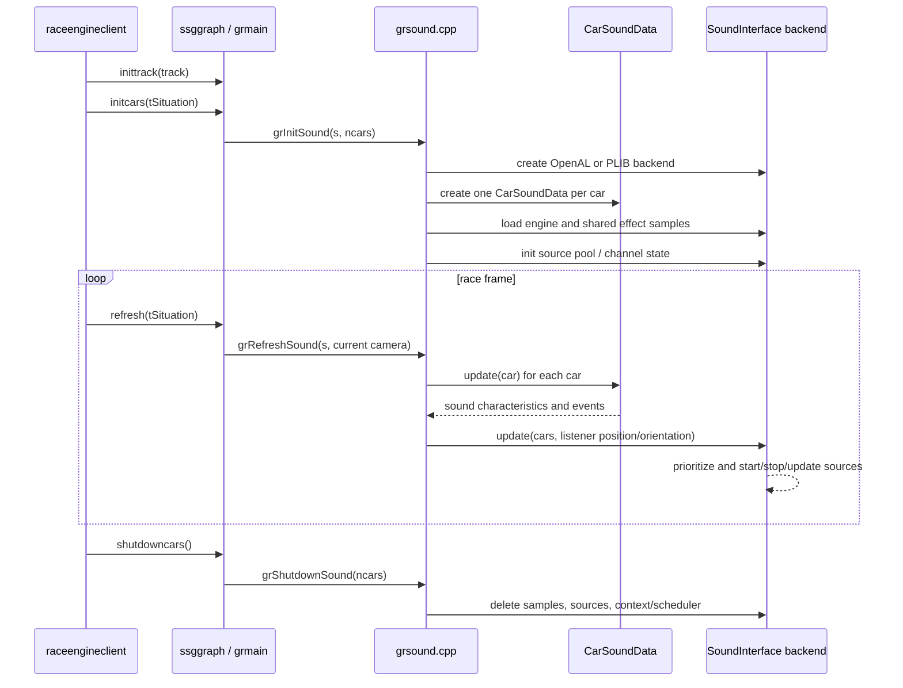
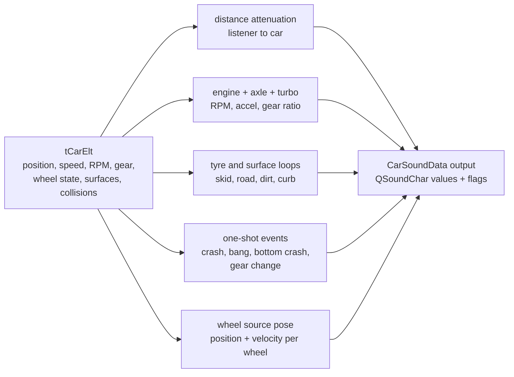
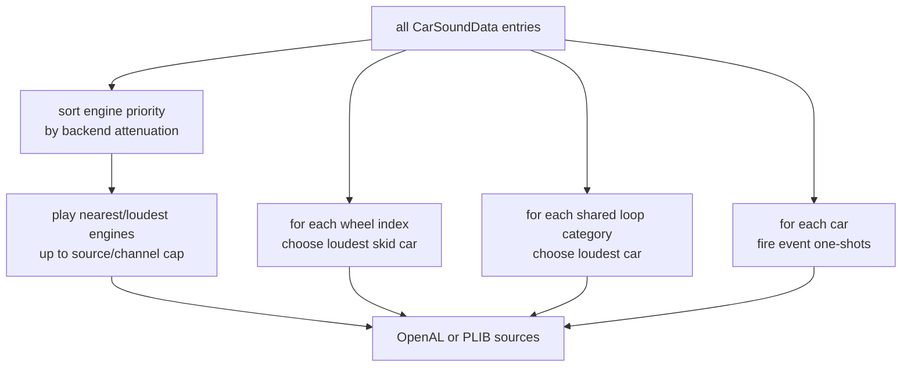
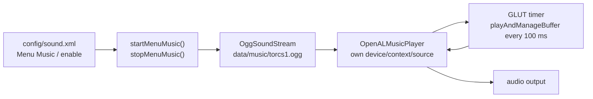

# TORCS Audio System Overview

This document explains how TORCS 1.3.9-test1 implements audio in the first-party
source tree. It focuses on the in-race vehicle/effects audio owned by the
`ssggraph` graphics module, and separately covers the menu-music player.

The important architectural point is that in-race sound is part of the legacy
presentation stack. The simulator writes physical state into `tCarElt`; the
graphics module reads that state, computes sound characteristics, and sends the
result to OpenAL or the older PLIB sound scheduler.

## System Shape

```mermaid
flowchart TB
    race["raceengineclient\nrace lifecycle and frame loop"]
    sim["simuv2 / simuv3\nphysics, wheels, collisions"]
    situation["tSituation / tCarElt\nshared race state"]
    graph["ssggraph graphics module\ntGraphicItf callbacks"]
    grsound["grsound.cpp\nsound lifecycle + frame refresh"]
    carsound["CarSoundData\nper-car sound model"]
    iface["SoundInterface\nbackend abstraction + source arbitration"]
    openal["OpenalSoundInterface\nOpenAL device, listener, sources"]
    plib["PlibSoundInterface\nPLIB slScheduler"]
    samples["data/sound/*.wav\ncar and global samples"]
    speaker["audio output"]

    race --> sim
    sim --> situation
    race --> graph
    graph --> grsound
    grsound --> situation
    grsound --> carsound
    carsound --> iface
    samples --> iface
    iface --> openal
    iface --> plib
    openal --> speaker
    plib --> speaker
```

In-race audio is initialized from the graphics module's car setup path:

- `src/modules/graphic/ssggraph/ssggraph.cpp` exports a `tGraphicItf` and
  registers `inittrack`, `initcars`, `refresh`, `shutdowncars`, and
  `muteformenu`.
- `grmain.cpp::initCars()` initializes car graphics, screens, smoke, then calls
  `grInitSound(s, s->_ncars)`.
- `grmain.cpp::refresh()` calls `grRefreshSound(s, grScreens[0]->getCurCamera())`
  before drawing the frame.
- `grmain.cpp::shutdownCars()` calls `grShutdownSound(grNbCars)` before
  releasing visual car resources.

Sound therefore follows the visible race view: screen 0's current camera is the
listener position/orientation for 3D race audio.

## Source Map

| Area | Main files | Responsibility |
| --- | --- | --- |
| Graphics/audio module entry | `ssggraph.cpp`, `grmain.cpp`, `grsound.cpp` | Connect race-engine callbacks to sound init, refresh, mute, and shutdown. |
| Public sound config symbols | `src/interfaces/graphic.h` | Defines `config/sound.xml`, sound state strings, volume, and `muteformenu`. |
| Per-car audio model | `CarSoundData.h`, `CarSoundData.cpp` | Converts `tCarElt` state into pitch, volume, filtering, source position, and event flags. |
| Backend abstraction | `SoundInterface.h`, `SoundInterface.cpp` | Owns shared sample slots, source-priority helpers, and backend virtual methods. |
| Individual sample wrapper | `TorcsSound.h`, `TorcsSound.cpp` | Backend-independent sound API plus OpenAL and PLIB implementations. |
| OpenAL backend | `OpenalSoundInterface.cpp` | Opens device/context, loads WAV buffers, manages static/dynamic sources, updates listener. |
| PLIB backend | `PlibSoundInterface.cpp` | Uses `slScheduler`, `slSample`, and envelopes for the older PLIB path. |
| Menu music | `src/libs/musicplayer/*` | Separate OpenAL Ogg streaming player for menu music. |
| Assets | `data/data/sound`, `data/data/music` | WAV effects/engine loops and `torcs1.ogg` menu music. |

## Configuration and Assets

Race sound and menu music share `config/sound.xml`. The default file is shipped
as `src/modules/graphic/ssggraph/sound.xml`:

```xml
<section name="Sound Settings">
    <attstr name="state" val="openal"/>
    <attnum name="volume" unit="%" val="100"/>
</section>

<section name="Menu Music">
    <attstr name="enable" val="enabled"/>
</section>
```

The runtime recognizes three in-race sound states:

| State | Meaning |
| --- | --- |
| `openal` | Default in-race backend. This is the backend exposed by the current sound config menu. |
| `plib` | Legacy backend still implemented in code, but not listed in the current sound config screen. |
| `disabled` | Skips in-race sound interface creation and refresh work. |

Cars also contribute audio parameters from their car XML:

| Car XML section | Attributes | Use |
| --- | --- | --- |
| `Sound` | `engine sample`, `rpm scale` | Chooses the engine WAV and maps RPM to sample pitch. |
| `Engine` | `turbo`, `turbo rpm`, `turbo lag` | Enables and shapes the turbo loop. |

`grInitSound()` first looks for engine samples under `cars/<car-name>/`; if the
file is not present, it falls back to `data/sound/<sample>`. Global effects such
as skid, road ride, curb ride, grass ride, crashes, turbo, axle, backfire, and
gear change are loaded from `data/sound`.

## Runtime Lifecycle



`grRefreshSound()` throttles sound updates to at most 100 Hz using the race
simulation time. For each update it:

1. Reads the active camera position, speed, center vector, and up vector.
2. Sets each `CarSoundData` listener position.
3. Updates each car's sound characteristics from `tCarElt`.
4. Calls the selected backend with all per-car sound data and listener vectors.

## Per-Car Sound Model

`CarSoundData` is the core behavior model. It does not play audio directly; it
turns physics state into small `QSoundChar` values containing amplitude (`a`),
frequency/pitch multiplier (`f`), and low-pass/filter factor (`lp`), plus
one-shot event booleans.



The main inputs are:

| Input from `tCarElt` | Audio use |
| --- | --- |
| `pub.DynGCg.pos`, `pub.DynGCg.vel` | Car source position and velocity. |
| `_enginerpm`, `_enginerpmRedLine`, `_gear`, `_gearRatio` | Engine pitch/filter, axle sound, gear-change event. |
| `ctrl.accelCmd` | Smooth accelerator value for engine filter and turbo response. |
| `_skid[4]`, `_wheelSlipAccel(i)`, `_reaction[4]` | Tire skid, road/curb ride, and wheel-load-dependent volume. |
| `priv.wheel[i].seg`, `otherSurfaceContribution`, `otherSurfaceSeg` | Surface material, roughness, curb/off-road mixing. |
| `priv.collision` | Dragging metal, crash, suspension bang, and bottom-crash events. |
| `priv.smoke` | Looping engine backfire contribution. |

Important behavior:

- Cars marked `RM_CAR_STATE_NO_SIMU` are muted.
- Distance attenuation is `1 / (1 + distance)` and is used mostly for
  prioritization.
- Engine pitch is approximately `rpm_scale * engine_rpm / 600`.
- Engine low-pass/filter behavior depends on redline ratio and smoothed
  accelerator input.
- Road, dirt/grass, and curb audio are mixed from wheel surface data. A tire can
  partially overlap a neighbor surface, so the code blends road and dirt
  contributions using `otherSurfaceContribution`.
- Collision flags are consumed by audio: `CarSoundData` clears
  `car->priv.collision` after converting it into sound flags.

## Sound Categories

| Category | Loop or one-shot | Source model | Notes |
| --- | --- | --- | --- |
| Engine | Loop | Per car | Uses car position/speed; pitch from RPM; source count is capped. |
| Axle | Loop | Loudest car | Derived from engine pitch change and gear ratio. |
| Turbo | Loop | Loudest car | Enabled per car by engine XML turbo settings. |
| Engine backfire loop | Loop | Loudest car | Driven by `priv.smoke` and engine RPM. |
| Tire skid | Loop | Loudest car per wheel index | Four global skid sources, one for each wheel slot. |
| Road ride | Loop | Loudest car | Includes road/wind-like rolling noise. |
| Grass/dirt ride | Loop | Loudest car | Uses off-road materials and roughness. |
| Grass/dirt skid | Loop | Loudest car | Uses off-road skid amount. |
| Curb ride | Loop | Loudest car | Additive curb effect, only with wheel load. |
| Metal skid | Loop | Loudest car | Smoothed drag-collision sound. |
| Crash variants | One-shot | Event car position | Rotates through `crash1.wav` to `crashN.wav`. |
| Suspension bang | One-shot | Event car position | Triggered by collision bit interpreted as suspension/full compression. |
| Bottom crash | One-shot | Event car position | Triggered by vertical/bottom crash bit. |
| Gear change | One-shot | Event car position | Triggered whenever current gear differs from previous gear. |

## Source Budgeting and Prioritization

TORCS does not attempt to play every possible sound from every car.
`SoundInterface` and its backends intentionally collapse many categories to keep
channel/source use bounded.



The common source rules are:

- `SoundInterface` computes `n_engine_sounds = n_channels - 12`, then clamps it
  to at most 8.
- Engine sounds are sorted by backend-computed source attenuation. Only the
  highest-priority engines are started; lower-priority engines are stopped or
  muted/paused depending on backend.
- Shared loop categories use `SortSingleQueue()` to find the car with the
  maximum `attenuation * amplitude`, then update a single sample for that
  category.
- Tire skid has four shared samples. For each wheel index, the loudest
  contributing car owns that wheel's skid sound.
- One-shot events are checked for every car, but may still be suppressed by
  backend thresholds or unavailable sources.

## OpenAL Backend

`OpenalSoundInterface` is the default runtime backend. On startup it:

1. Opens the default OpenAL device and creates a context.
2. Probes how many sources and buffers can be created.
3. Reserves most sources for statically assigned sounds while keeping at least
   four dynamic sources.
4. Sets `AL_INVERSE_DISTANCE`, Doppler parameters, initial listener state, and
   later global gain.
5. Loads WAV files through ALUT into OpenAL buffers.

OpenAL sounds come in two source-allocation modes:

- Static-source sounds request a source during construction and keep it.
- Dynamic-source sounds load a buffer but defer source assignment to
  `SharedSourcePool`. This is used for engine loops so scarce sources can move
  among prioritized cars.

During `update()` the OpenAL backend:

- Updates the listener position and orientation from the active camera.
- Computes source environmental parameters with `SoundSource`.
- Sorts engine sources and starts/stops dynamic engine sounds.
- Updates shared loop samples and one-shot samples.
- Applies global gain with `alListenerf(AL_GAIN, getGlobalGain())`.

OpenAL Doppler is compiled out by default in this file. Instead, the code
computes a pitch multiplier in `SoundSource::update()` and multiplies it into
sample pitch. Source velocities passed to OpenAL are set to zero in
`OpenalTorcsSound::update()`.

## PLIB Backend

`PlibSoundInterface` is the older backend. It still exists and recognizes the
`plib` sound state, but the current config menu lists only OpenAL and disabled.

PLIB uses:

- `slScheduler` with a maximum concurrent channel count.
- `PlibTorcsSound`, which wraps `slSample`.
- `slEnvelope` objects for volume, pitch, and low-pass/filter control.
- `sched->update()` once per sound update.

The PLIB backend shares the same high-level car model and source prioritization
ideas as OpenAL, but applies gain and filtering differently. The base
`TorcsSound` comment explicitly warns that volume and pitch semantics are not
fully consistent across PLIB and OpenAL.

## Menu Music

Menu music is separate from the in-race `SoundInterface` path.



`src/libs/musicplayer/musicplayer.cpp` checks the `Menu Music` section in
`config/sound.xml`. If enabled, it creates a static `OpenALMusicPlayer` around
`data/music/torcs1.ogg`, starts playback, and schedules buffer maintenance via
`glutTimerFunc`.

`OpenALMusicPlayer` owns its own OpenAL device, context, source, and two
streaming buffers. It queues two decoded Ogg buffers, unqueues processed buffers,
refills them, and restarts playback if needed. This path is for menus only; it
does not share the race audio backend, listener, or source-priority logic.

## Porting Implications

For a browser or modern-engine port, the behavior to preserve is not the OpenAL
API itself; it is the data model and source budgeting:

- Export enough telemetry to reproduce `CarSoundData`: car position/velocity,
  RPM/redline, gear/gear ratios, accel command, wheel spin, wheel slip,
  wheel reaction, wheel segment surface/material, roughness, skid values,
  collision flags, smoke/backfire signal, and wheel-relative positions.
- Reimplement the per-car characteristic calculations before tuning samples.
  Most of TORCS' audio feel comes from how pitch/volume are derived, not from
  backend-specific OpenAL calls.
- Keep source budgeting explicit. Native TORCS intentionally caps engines,
  shares loop categories, and chooses the loudest source per category.
- Treat race audio and menu music as separate systems unless the new runtime has
  a strong reason to unify them.
- Be careful with event consumption. Collision flags are cleared by
  `CarSoundData`, so a port that reads the same state later must define who owns
  those one-shot events.

## Known Quirks and Caveats

- Race sound is tied to the graphics module lifecycle, so headless races do not
  initialize this audio path.
- Only screen 0's active camera is used as the listener, even in multi-screen
  configurations.
- The current sound configuration menu comments out the PLIB option even though
  the backend still exists.
- `SoundSource::update()` implements distance attenuation, low-pass-like
  attenuation, and Doppler-style pitch manually. Backend Doppler behavior is not
  the primary source of pitch shift in the default OpenAL build.
- The OpenAL update path queues `backfire_loop` twice in succession. This looks
  redundant, but it is harmless for documentation purposes and should be treated
  cautiously before changing behavior.
- Menu music creates its own OpenAL context. That is independent of race audio,
  but it means menu and race audio lifetimes are not a single shared mixer.
