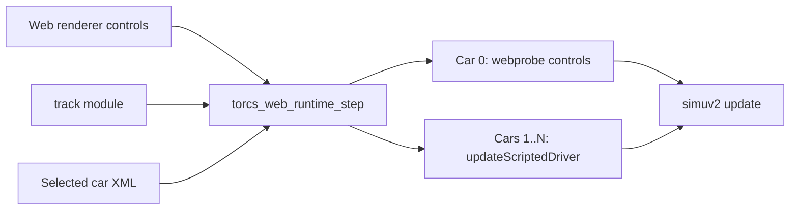

# TORCS Robot Driver Web Port Plan

This document explains how robot drivers work in native TORCS, how the current
web runtime differs, and what needs to be built to run real TORCS AI drivers in
the browser.

## Current Web State

The web runtime does not currently use TORCS robot driver modules for opponent
cars. Opponents named `webai*` are scripted inside the web probe runtime.



Important consequences:

- `webai*` is not a TORCS-provided AI module.
- Opponent cars are marked as robot drivers, but they are not attached to a
  `tRobotItf` instance.
- `updateScriptedDriver()` writes directly to `tCarElt::ctrl` fields such as
  `steer`, `accelCmd`, `brakeCmd`, `clutchCmd`, and `gear`.
- Current tests can validate the scripted behavior, but they cannot compare
  against native TORCS AI behavior because the web opponents are a different
  implementation.

The web runtime already uses native TORCS pieces for track loading and physics:
`track` and `simuv2` are available through the web platform module registry.
The missing piece is the robot-driver lifecycle.

## Native Robot Driver Flow

Native TORCS treats robot drivers as dynamically loaded modules. The public
driver ABI is defined by `src/interfaces/robot.h`, primarily through
`tRobotItf`.

At race initialization time, `src/libs/raceengineclient/raceinit.cpp` performs
the driver setup:

```mermaid
flowchart TD
    RaceConfig[Race config: Drivers Racing entries]
    RaceConfig --> ModuleName[Read module name and robot index]
    ModuleName --> LoadModule[GfModLoad drivers/module/module.so]
    LoadModule --> ModInfo[tModInfo list]
    ModInfo --> Init[fctInit(robotIdx, tRobotItf*)]
    Init --> DriverXml[drivers/module/module.xml]
    DriverXml --> CarChoice[Driver car, name, type, skill, team]
    CarChoice --> CarXml[cars/car/car.xml]
    CarXml --> CategoryXml[categories/category.xml]
    CategoryXml --> MergeSetup[Merge category, car, and driver setup]
    MergeSetup --> NewTrack[rbNewTrack]
    NewTrack --> NewRace[rbNewRace]
    NewRace --> DriveLoop[rbDrive every simulation tick]
    DriveLoop --> Sim[simuv2]
```

The important native setup details are:

| Area | Native behavior |
| --- | --- |
| Module lookup | Reads driver module names from race configuration. |
| Module loading | Loads `drivers/<module>/<module>.<DLLEXT>` with `GfModLoad`. |
| ABI binding | Calls the module `fctInit` function to fill a `tRobotItf`. |
| Driver data | Reads `drivers/<module>/<module>.xml` and driver-specific sections. |
| Car identity | Fills fields such as `_driverIndex`, `_modName`, `_name`, `_teamname`, `_carName`, `_driverType`, `_skillLevel`, and `_startRank`. |
| Setup merge | Loads category, car, and driver setup XML and passes the merged handle through the lifecycle. |
| Track callback | Calls `rbNewTrack(robotIdx, track, carHandle, &handle, situation)`. |
| Race callback | Calls `rbNewRace` before active driving. |
| Tick callback | Calls `rbDrive` each simulation step to populate `car->ctrl`. |
| Shutdown | Calls shutdown callbacks when the race or module is torn down. |

The web runtime currently bypasses most of this and only provides enough car
state for `simuv2` to advance a race-like scene.

## Gap Analysis

| Capability | Current web runtime | Needed for real TORCS AI |
| --- | --- | --- |
| Robot module loading | None for AI drivers. | Static or dynamic registration of driver modules. |
| Driver ABI | No `tRobotItf` instances. | Allocate and initialize `tRobotItf` for each robot slot. |
| Driver roster | UI chooses one player car and a car count. | Race roster with module name, robot index, and car per opponent. |
| Driver XML | Not loaded for opponents. | Preload and read `drivers/<module>/<module>.xml`. |
| Car setup merge | Basic selected car setup reused across cars. | Match native category, car, and driver setup merge. |
| Lifecycle callbacks | Scripted function per tick. | `rbNewTrack`, `rbNewRace`, `rbDrive`, pit callback, shutdown. |
| Per-driver state | Only simple lane/speed script state. | Let each robot module own its native state and config. |
| Native parity tests | Not meaningful yet. | Compare native and WASM robot outputs on identical inputs. |

## Porting Strategy

### Phase 0: Preserve the Current Runtime While Adding Hooks

Add a small web-side robot abstraction without changing behavior:

- Represent each opponent as a slot containing module name, robot index,
  `tRobotItf`, car XML path, and lifecycle state.
- Keep the scripted `webai*` path as a fallback driver.
- Add instrumentation so tests can assert whether a car is scripted or backed by
  a real robot callback.

This phase should keep existing web smoke tests passing.

### Phase 1: Static-Link One Native Robot Driver

Emscripten is not a natural fit for TORCS-style runtime `.so` loading, so the
first web port should statically link a small driver module and register it in
the same spirit as the current web `track` and `simuv2` registry.

Recommended first target:

- Start with one relatively simple robot module.
- Register its `tModInfo` entries in the web platform registry.
- Preload its driver XML, required car XML, and category XML.
- Instantiate one opponent through `tRobotItf`.
- Call `rbNewTrack`, `rbNewRace`, and `rbDrive`.
- Confirm that `rbDrive` writes plausible steering, throttle, brake, and gear
  commands.

The goal is one real TORCS robot moving one opponent around one converted track,
not full race-engine parity.

### Phase 2: Replace Scripted Opponent Roster

Once one robot works, expand the web runtime's opponent setup:

- Model opponents as `(module, index, car)` entries instead of anonymous
  `webai*` cars.
- Generate or maintain a manifest of available robot drivers and their cars.
- Expose roster choices in the web renderer.
- Keep a "quick race" preset that maps to a known-good driver/car/track
  combination.

At this point, `webai*` can remain as a debug fallback, but it should no longer
be the default opponent behavior.

### Phase 3: Broaden Driver and Data Coverage

Different TORCS drivers have different data expectations. Some only need their
module XML. Others may use track-specific setup files, learned data, skill
settings, or writable runtime state.

This phase should:

- Add more robot modules incrementally.
- Audit each module's file reads and writes.
- Preload required files into the browser virtual filesystem.
- Decide how writable driver state should behave in the web build.
- Track binary size and load time as more drivers are linked.

### Phase 4: Native-vs-WASM Parity Tests

Meaningful AI parity tests require both native TORCS and the web runtime to use
the same robot driver logic.

The practical test plan is:

- Build a native headless reference harness using a fixed race config, track,
  car, and robot driver.
- Log per-tick inputs and outputs: position, yaw, speed, track position,
  steering, throttle, brake, gear, and lap progress.
- Run the same scenario in the WASM runtime.
- Compare controls and trajectory within tolerances.

Exact floating-point equality is not expected. The useful signal is whether the
same robot makes the same driving decisions and remains on a similar trajectory.

## Build and Data Work

The port needs both code and asset-pipeline changes.

| Area | Required work |
| --- | --- |
| Build system | Compile selected `src/drivers/*` modules into the WASM target. |
| Module registry | Register statically linked driver modules for web lookup. |
| Driver files | Include `drivers/<module>/<module>.xml` and related setup files. |
| Car files | Ensure every robot-selected car is converted and preloaded. |
| Category files | Include category XML files needed for native setup merging. |
| Runtime filesystem | Define read-only preloaded data and any writable driver state path. |
| UI | Expose driver/car/track roster choices from generated manifests. |

## Risks and Decisions

| Decision | Recommendation |
| --- | --- |
| Dynamic modules vs static linking | Use static linking first. It is simpler, easier to test, and matches the current web module approach. |
| Reuse full race engine vs minimal web harness | Start with the minimal lifecycle needed by robot drivers. Pull in more race-engine behavior only when a driver needs it. |
| Writable driver state | Prefer read-only deterministic defaults first. Add browser persistence only after parity is understood. |
| Driver selection | Begin with a curated known-good roster, then expand to generated discovery. |
| Test strictness | Compare behavior with tolerances, not bit-exact state. |
| Scripted fallback | Keep it during the transition, but make it visibly distinct from real robot drivers. |

## Recommended First Milestone

The best next implementation target is:

1. Static-link one native robot driver into the WASM build.
2. Register it in the web module registry.
3. Preload its driver XML plus one known-good car/category setup.
4. Instantiate one opponent through `tRobotItf`.
5. Call `rbNewTrack`, `rbNewRace`, and `rbDrive` from the web runtime.
6. Add a smoke test proving the robot callback is active and produces sane
   controls over a short run.

That milestone would convert the web renderer from "custom scripted opponents"
to "at least one real TORCS robot driver running in-browser" while keeping the
scope small enough to debug.
