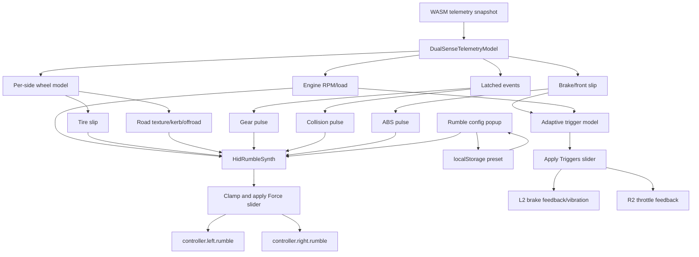

# DualSense Rumble Design

This document describes the current TORCS-Web DualSense haptics path in
`src/web/renderer/haptics.js`. The normal gameplay path uses `dualsense-ts`
HID rumble and adaptive triggers. The USB audio/PCM path is intentionally kept
as speaker debug only; it is not used as the primary haptic output.

## Output Pipeline

The renderer reads the shared WASM telemetry snapshot once per frame and maps
it into a `DualSenseTelemetryModel`. That model extracts per-side signals for
the left and right wheels, then `HidRumbleSynth` converts those signals into
left and right rumble values.

Rumble writes are throttled to about 30 Hz in `DualSenseHaptics.updateRumble()`.
That matches the practical output cadence of `dualsense-ts`, which flushes HID
output reports at roughly the same rate. The synthesizer therefore generates
control-rate tactile envelopes, not audio-rate PCM.

Final rumble values are clamped to `[0, 1]` and multiplied by the Haptics
`Force` slider before being sent to:

```js
controller.left.rumble(left)
controller.right.rumble(right)
```



## Rumble Configuration Popup

The `Config` button beside `Haptics` opens a runtime tuning popup for
experiential testing. It is intentionally source-oriented rather than
device-oriented: every row maps to one contribution that appears in the mix.

The popup provides:

- `On`: enables or disables one source.
- `Solo`: mutes every other source so the selected source can be evaluated in
  isolation.
- `Gain`: scales that source before final clamping and before the global
  `Force` slider.
- Source-specific sliders, such as pulse rate, decay, texture noise, and engine
  modulation depth/rate.
- `Copy JSON`, `Paste JSON`, and `Reset Defaults` for quick A/B testing and
  sharing settings.

Settings are sanitized and persisted in browser `localStorage` under:

```text
torcs-web:dualsense-rumble-config:v1
```

The active configuration is also available through `window.torcsHaptics`:

```js
window.torcsHaptics.getRumbleConfig()
window.torcsHaptics.setRumbleConfig({ slip: { gain: 1.25 } })
window.torcsHaptics.importRumbleConfig(json)
window.torcsHaptics.resetRumbleConfig()
```

Diagnostics include a compact `rumbleConfig` summary and the last
`rumbleOutput`, including per-source contribution values. This makes it
possible to tell whether a source is mathematically active even when the
physical controller feel is subtle.

The `Signal` tab visualizes the same diagnostics data. It shows the final left
and right HID rumble envelopes, per-source contribution bars, and a short
rolling scope. This is not an audio-rate PCM waveform; it is the control-rate
signal sent through `controller.left.rumble()` and `controller.right.rumble()`.

## Source Contributions

### Engine

Engine vibration is a centered baseline present on both grips. The telemetry
model computes:

```text
engine frequency = clamp((rpm / 60) * (cylinders / 2), 30, 220)
engine amplitude = clamp((0.025 + throttle * 0.11) *
                         (0.35 + 0.65 * revRatio), 0, 0.16)
```

The rumble synth does not try to reproduce that frequency directly as PCM.
Instead it uses the frequency to choose a low-rate amplitude modulation:

```text
engineRate = 7 + clamp(engineFrequency / 22, 0, 9)
engine = engineAmplitude * 1.7 * engineMod
```

This makes higher RPM/load feel more active while keeping the signal inside the
low-rate HID rumble bandwidth.

The config popup exposes engine `gain`, modulation depth, and modulation rate
scale. Turning modulation depth down makes the engine a steadier baseline;
turning rate scale up makes RPM changes feel busier.

### Tire Slip

Tire slip is the main traction warning. Each wheel contributes the maximum of:

```text
wheelSkidIntensity
abs(wheelSlipSide) * 0.075
abs(wheelSlipAccel) * 0.015
```

That value is converted through `smoothstep(0.055, 0.45, slipSignal)` so minor
slip stays quiet and larger traction loss ramps in quickly. Left-side wheels
feed the left grip; right-side wheels feed the right grip.

The rumble synth applies a shudder envelope:

```text
slipPulse = 0.62 + 0.38 * abs(sin(13.5 Hz phase))
side += sideSlip * 0.58 * slipPulse
```

The config popup exposes slip `gain` and pulse rate. Raising pulse rate makes
traction loss buzzier; lowering it makes the slip warning more like a slow
shudder.

### Road Texture, Kerbs, and Offroad

Surface texture is derived per wheel from suspension reaction, speed, surface
roughness, offroad state, and kerb style:

```text
reactionLevel = tanh(wheelReaction * 0.00028)
surfaceTexture = speedNorm * reactionLevel *
                 (0.025
                  + clamp(roughness * 1.8, 0, 0.55)
                  + 0.48 * offroad
                  + 0.7 * curb)
```

This is spatially routed by wheel side, so left dirt/kerb contact appears on
the left grip and right contact appears on the right grip. The rumble synth
multiplies each side by deterministic noise:

```text
side += sideTexture * 0.54 * sideNoise
```

The noise is intentionally control-rate and seeded, giving rough surfaces a
grainy feel without using speaker audio.

The config popup exposes texture `gain` and noise depth. Lower noise keeps
surface feel steadier; higher noise makes kerbs and dirt more granular.

### Gear Shifts

Gear changes are edge-triggered from `SNAPSHOT.gearChangeEvent`. When the event
increments or becomes active, the rumble synth sets a centered `gearPulse` to
`1`. It contributes:

```text
centerBurst += gearPulse * 0.3
gearPulse *= exp(-dt / 0.085)
```

The result is a short mechanical thump on both grips.

The config popup exposes gear `gain` and decay. Decay controls how quickly the
thump disappears after the event edge.

### Collisions

Collisions are edge-triggered from `SNAPSHOT.collisionEvent`. A changed nonzero
event sets `collisionPulse` to `1`. It contributes:

```text
centerBurst += collisionPulse * 0.85
collisionPulse *= exp(-dt / 0.16)
```

This creates a stronger, longer centered impact than a gear shift.

The config popup exposes collision `gain` and decay for separating quick taps
from longer crash envelopes during testing.

### ABS and Braking

ABS is inferred when braking is high and front slip is present:

```text
absPulse = brake > 0.45 && frontSlip > 0.32
```

ABS contributes in two places:

- L2 switches from steady brake resistance to `TriggerEffect.Vibration`.
- Rumble gets a centered pulse:

```text
centerBurst += absPulseWave * 0.24
absPulseWave = 0.5 + 0.5 * abs(sin(15.5 Hz phase))
```

The L2 trigger vibration frequency is also based on front slip:

```text
frequency = 32 + round(18 * frontSlip)
```

The config popup exposes ABS rumble `gain` and pulse rate. The L2 trigger
strength remains controlled by the separate `Triggers` slider.

## Adaptive Trigger Controls

Adaptive triggers are separate from grip rumble. The UI has two haptic sliders:

- `Force`: scales final left/right rumble.
- `Triggers`: scales L2/R2 adaptive trigger feedback only.

The trigger slider is applied in `DualSenseHaptics.scaleTriggerFeedback()`. It
multiplies `strength` for normal trigger resistance and `amplitude` for ABS
trigger vibration. It does not change rumble intensity.

R2 represents throttle spring force:

```text
strength = clamp(0.22 + throttle * 0.42 + revRatio * 0.12, 0, 0.82)
```

L2 represents brake pressure:

```text
normal brake strength = clamp(0.45 + brake * 0.42, 0, 0.92)
ABS brake vibration amplitude = clamp(0.45 + frontSlip * 0.45, 0, 1)
```

## Mixing Summary

Each grip receives:

```text
sideRumble =
    engineBaseline
  + sideSlipShudder
  + sideRoadTextureNoise
  + centeredGearBurst
  + centeredCollisionBurst
  + centeredAbsPulse
```

The mix is clamped, scaled by the `Force` slider, and sent through HID rumble.
This keeps gameplay haptics on the controller's actual rumble path and avoids
audible DualSense speaker PCM during normal driving.
